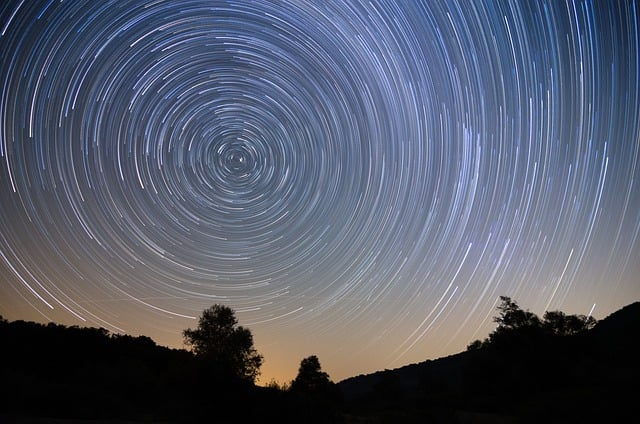
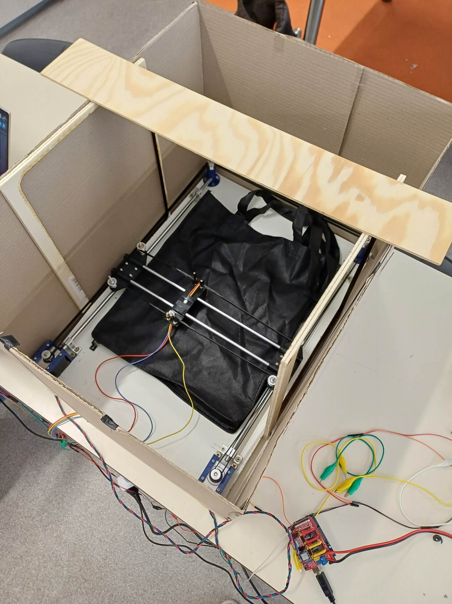
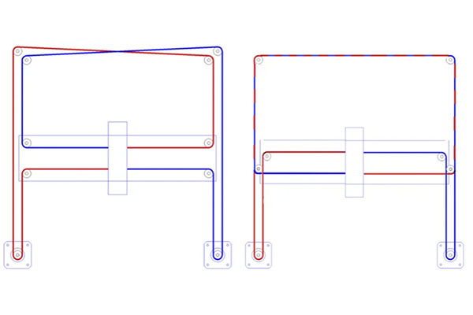
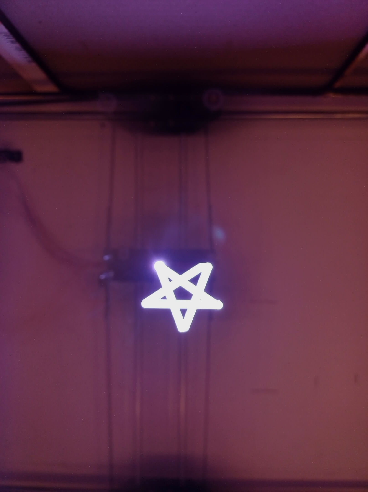
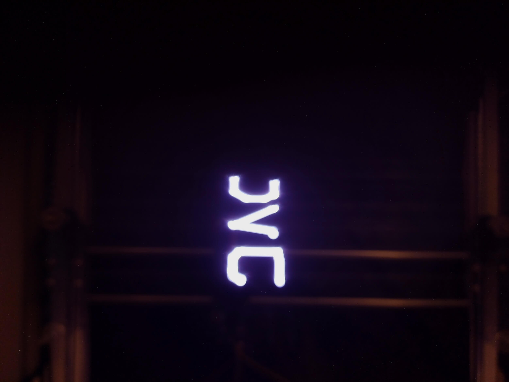
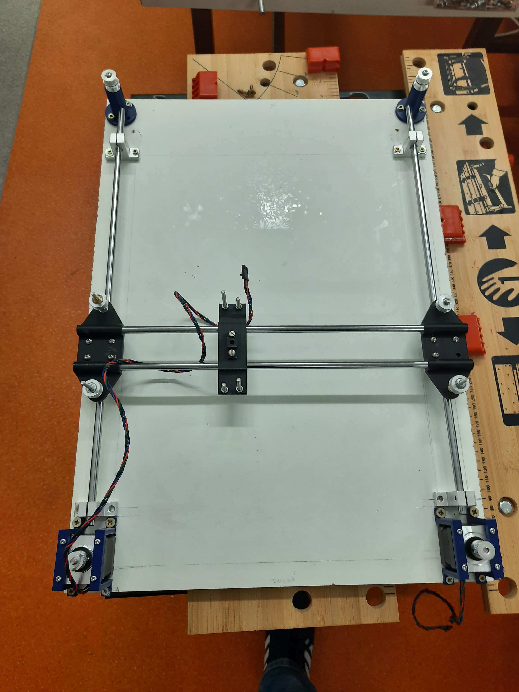
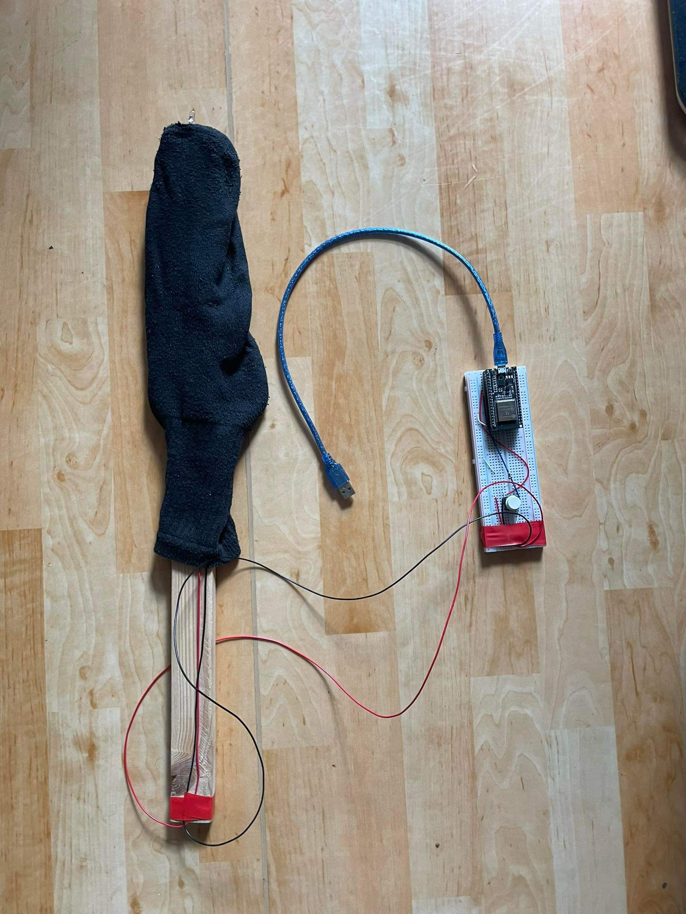
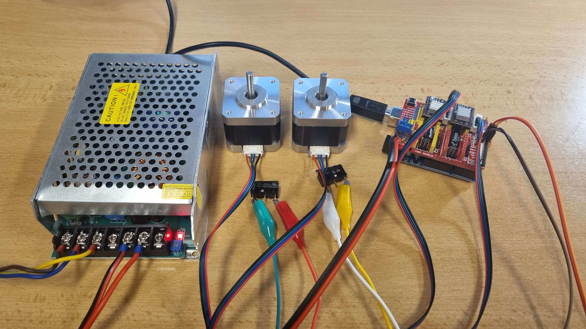
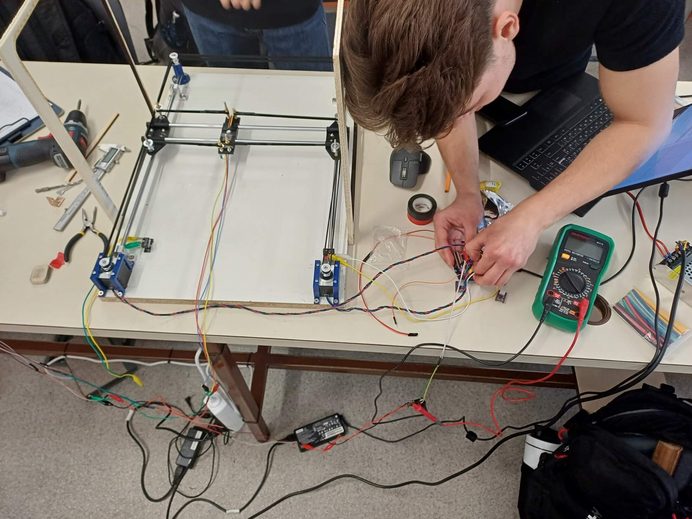
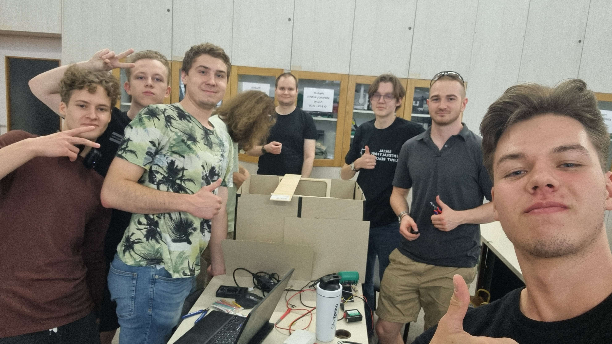

# Machine Bravo - Long exposure

**Note**: the documentation for this project was taken from our team repository on GitLab for the FEL faculty.

## Machine Description
Long exposure is a popular technique among photographers. The basic principle is to keep the shutter open for an extended period when taking a photograph. Dynamic objects will appear blurred in the final image. When used correctly, it creates visually impressive photos, as shown in the image below:

Inspired by this idea, we designed a machine that uses a diode and a long-exposure camera to create a photograph from a given vector graphic.

Here's also a <a href="https://www.youtube.com/shorts/Jw3UbjsMnYU">video</a> with a small demonstration.

## Operation
The machine is powered from the mains. To operate it, connect an Arduino Nano to your computer for controlling the LED, and an Arduino Uno with a motor shield for controlling the motors. Using the application, select an .svg vector image you want to draw. The image is then converted into instructions for motor movement. To start drawing and capturing the photograph, press the button.

## Machine Mechanism
The entire machine operation is divided into several smaller modules, which are described below. The basic principle is that the machine converts vector graphics into the movement of a point in a plane. This point is the LED, which traces the mentioned graphic. This creates a "light trail" captured by a long-exposure camera. The result is a photograph depicting the object drawn with light.

### Basic Construction
The construction consists of two parts. The first part is the frame with motors and a camera, and the second part is the shielding.
The frame dimensions are 60 x 45 cm.
The shielding is a cardboard box that prevents light from entering the machine during photo capture. There is an opening at the top of the shielding through which the camera captures the inside of the box. The interior is blackened as much as possible to reduce light reflections from the LED, which degrade the quality of the final image.

### Movement Mechanics
We used the CoreXY model for moving the LED. The advantage of this model is that it is well-known and widely used, and the two stepper motors are stationary, with belts handling the movement, as shown in the image.

The machine is also equipped with a limit switch, which helps the machine find its home position upon startup, from where it begins drawing.

### Converting Vector Graphics to Motor Movement
To convert the .svg file, we created a Python program that translates the graphic into G-code. This G-code is then sent via the *Universal G-code Sender* application to the Arduino shield and converted into motor movement using GRBL.

### LED
We used a programmable LED from a JVC kit. For easier connection and control, we created a printed circuit board attached to the bottom of the machine's moving block.

### Camera
A mobile phone with a longer exposure time setting, such as 30 seconds, is sufficient for capturing images.

## Result
As an example of the captured image, below are two pictures - a star and the well-known and beloved abbreviation.

## Specifications
The machine's input is an .svg vector file. The machine can draw images up to 30 x 30 centimeters. The machine's dimensions are 60x45x40 cm. It requires mains power for operation.

     

## Manufacturing Process Documentation
### Meeting and Machine Selection, Work Distribution
We started by selecting our machine. Other candidates included a muffin filler and a PCB manufacturing machine. We divided the project into several smaller parts and allocated them to smaller work groups.

### Frame Design
This is what our frame design looked like in Fusion 360, which serves for movement in the plane. The second image shows the actual implementation.

### LED Testing
Before building the machine, we tested whether our concept would work. We created a very simple tool for this purpose. Its functionality far exceeds its humorous appearance!

### Motor Testing
Before moving the motors directly on the machine, we tested their control at home on a smaller setup. The image shows the power source, two stepper motors, and an Arduino with a shield.

### Final Adjustments
The image below captures the scene during the final adjustments to the machine.

## Team
Feik Marek - idea, LED, documentation
Šimon Dratva - GRBL, CNC control setup
Bohdan Zhytnik - design and assembly of the basic structure
Vojtěch Neuman - LED
Oleh Borys - movement mechanics: GRBL and stepper motors

Thanks to everyone for their collaboration

