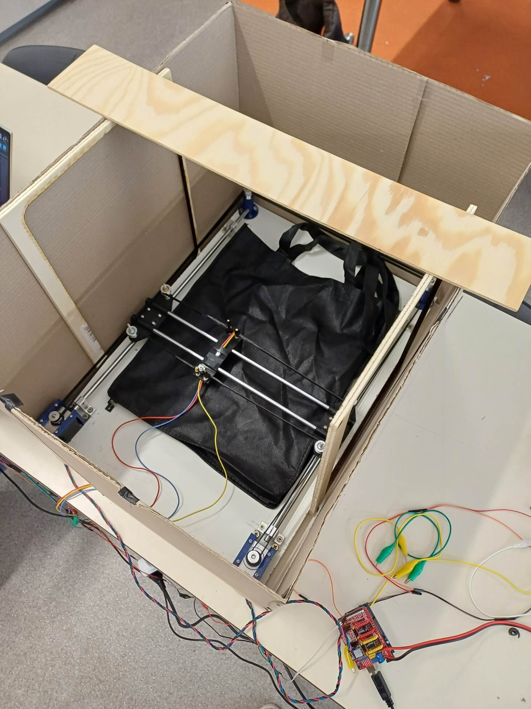
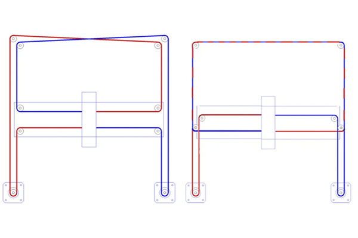
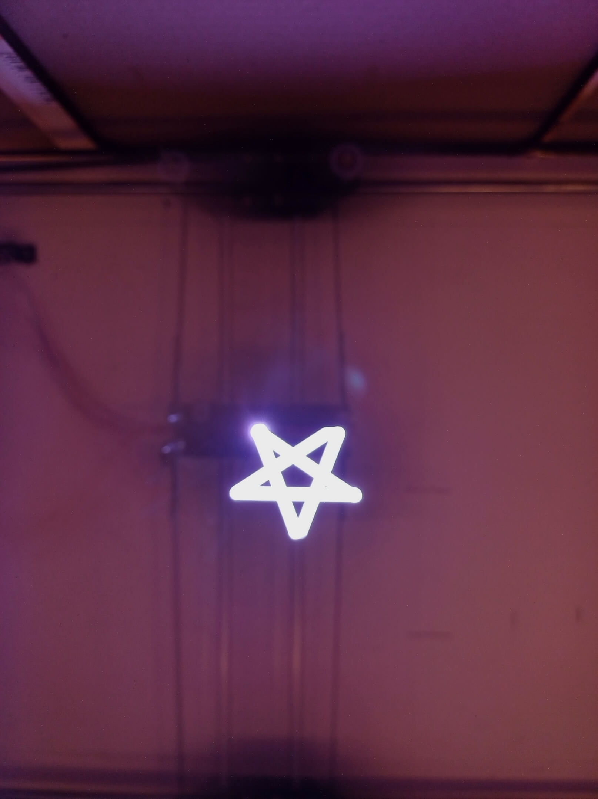
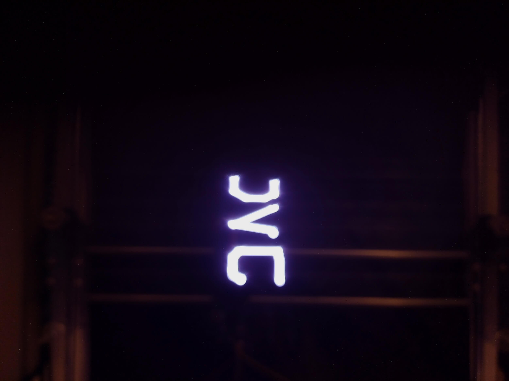
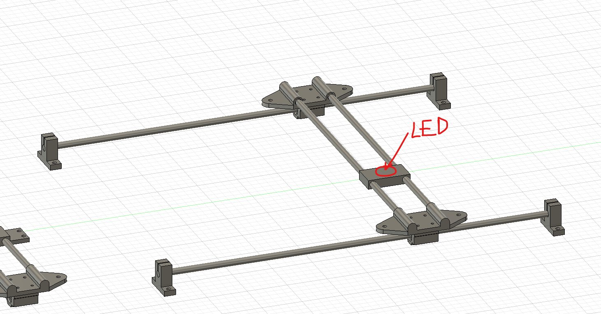
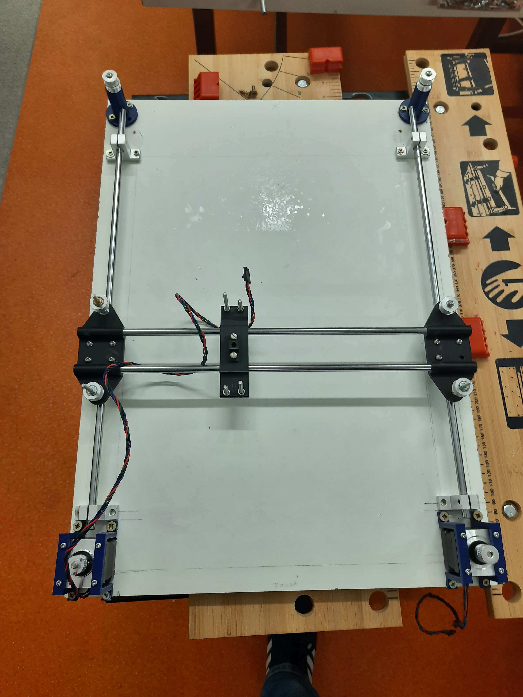
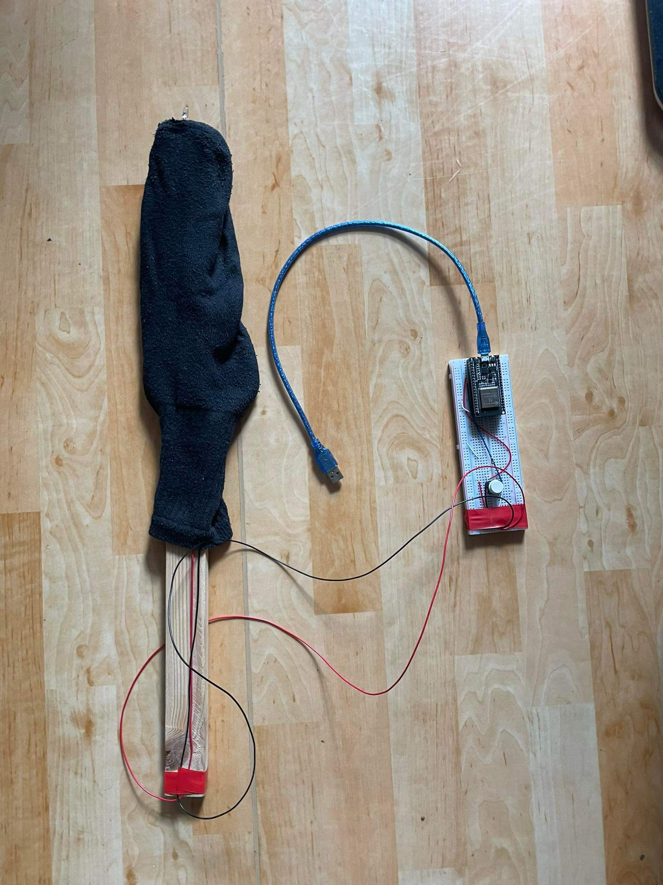
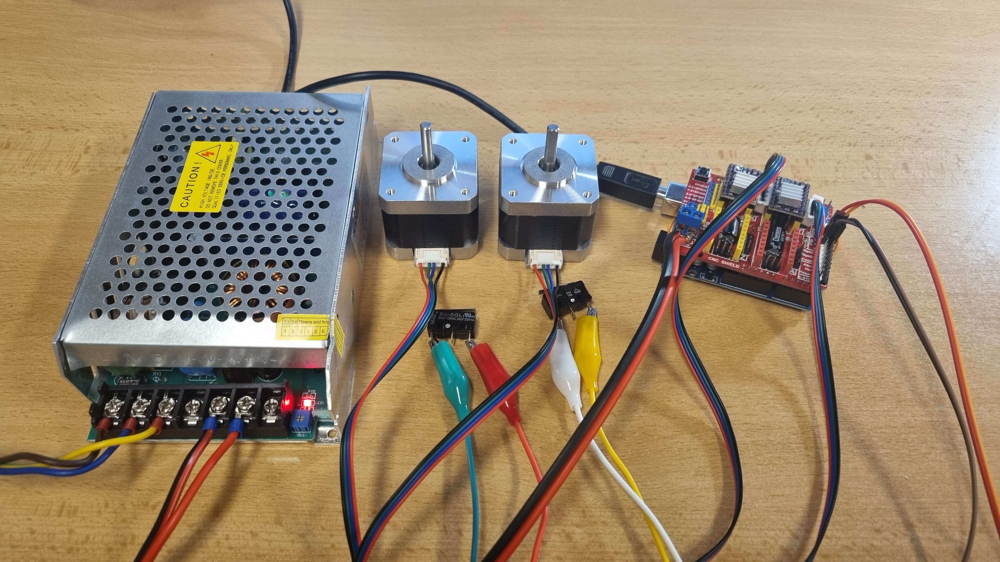
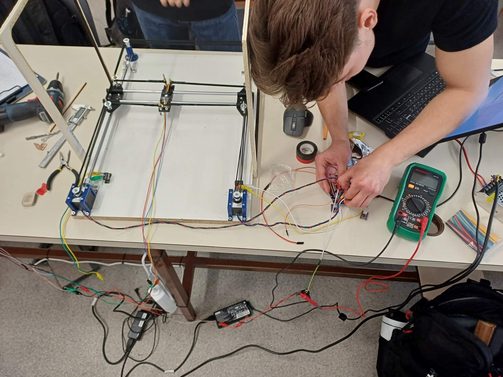
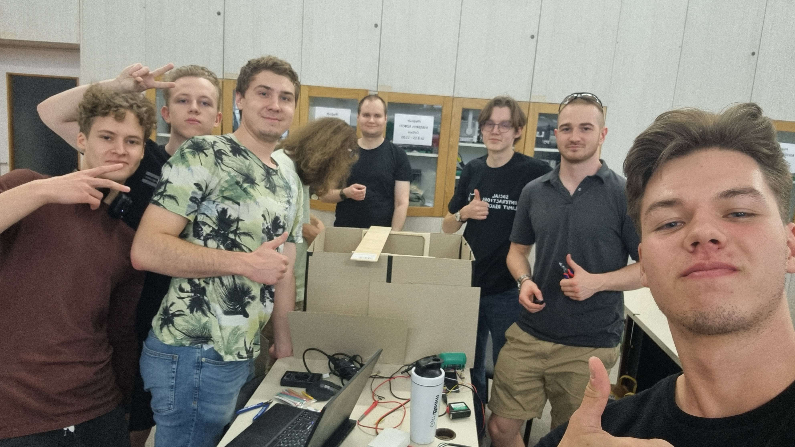

# Stroj Beta - Dlouhá expozice

**Note**: the documentation for this project was taken from our team repository on GitLab for the FEL faculty.

## Popis stroje
Dlouhá expozice patří mezi populární techniky v komunitě fotografů. Základním principem je prodloužené otevření závěrky při snímání fotografie. Dynamické objekty se na výsledném obrazu projeví rozmazané. Správné použití vede k vytvoření vizuálně impresivních snímků, viz obrázek

Na této myšlence jsme vymysleli stroj, jehož účelem je ze zadané vektorové grafiky vytvořit pomocí diody a kamery s dlouhou expozicí fotografii.

A ještě <a href="https://www.youtube.com/shorts/Jw3UbjsMnYU">video</a> s malou ukázkou

## Ovládání
Stroj se napájí ze sítě. Pro je ho ovládání je nutné si k počítači připojit Arduino Nano pro ovládání LEDky a Arduino se shieldem pro ovládání motorů. Pomocí aplikace vyberete .svg vektoroý obrázek, který chcete nakreslit. Obrázek je následně převeden na instrukce pro pohyb motorů. Pro začátek kreslení a snímání fotografie je na závěr nutné zmáčnout tlačítko.

## Mechanizmus stroje
Celé fungování stroje je rozděleno do několika měnších modulů, které jsou níže rozepsané. Základní princip spočívá v tom, že stroj převede vektorovou grafiku na pohyb bodu v rovině. Tento bod je právě LEDka, která opíše již zmíněnou grafiku. Tím vzniknne "světelná čára", která je snímána kamerou s dlouhou expozicí. Výsledkem je pak fotografie zachycující světlem nakreslený objekt.

### Základní konstrukce
Konstrukce se skládá ze dvou částí. První z nich je rám s motory a kamerou a druhou částí je stínění.
Rám má rozměry 60 x 45 cm.
Stínění je kartonová krabice, která brání vniknutí světla dovnitř ke stroji při pořizování snímku. Na vrchu stínění je otvor, kterým kamera snímá vnitřek krabice. Uvnitř boxu je snaha o začernění co nejvíce plochy, neboť odrazy světla LEDky od stěn zhotšují kvalitu výsledného snímku.

### Mechanika pohybu
Pro pohyb LEDky jsme použili model CoreXY. Výhodou je, že model je velmi známý a rozšířený, a také že dva použité stepper motory jsou stacionární, takže o samotný pohyb se starají pásy, jak je vidět na obrázku.

Jelikož stepper motory neznají svou pozici, stroj je vybaven i limit switchem, díky kterému si stroj po zapnutí najde výchozí pozici - home position, ze které začíná kreslit.

### Převod vektorové grafiky na pohyb motorů
Pro převedení .svg souboru jsme v Pythonu vytvořili program, který grafiku převede na g kód. Ten je poté poslán přes aplikaci *Universal g-code sender* do Arduino shieldu a pomocí grbl převeden na pohyb motorů. 

### LEDka
Využili jsme programovatelnou LEDku z pásku z JVC kitu. Pro její snažší zapojení a ovládání jsme vytvořili tištěný spoj, který je přidělán ze spodu na pohyblivém bloku stroje.

### Kamera
Pro snímání obrázků postačí mobilní telefon, u kterého je možné nastavit delší čas expozice, například 10 vteřin.

## Výsledek
Jako příklad toho, jak může vypadat pořízený snímek, jsou níže vidět dva obrázky - hvězda a všem známá a milovaná zkratka.

## Parametry
Vstupem stroje je .svg vektorový soubor. Stroj dokáže kreslit obrázku o maximálních rozměrech 30 x 30 centimetrů. Rozměry samotného stroje jsou 60x45x40 cm. K napájení je potřeba síť.

     
## Dokumentace postupu výroby
### Schůzka a výběr stroje, rozdělení práce
Začali jsme výběrem našeho stroje, mezi dalšími kandidáty byla plnička muffinů nebo stroj na výrobu plošných spojů. Projekt jsme rozdělili na několik menších dílčích částí a ty si rozdělili do menších pracovních skupin.
### Design rámu
Takto vypadal design našeho rámu ve Fusionu 360, který složí pro pohyb v rovině. Na druhém obrázku je pak reálné vyhotovení. 

### Zkouška LEDky
Před tvorbou stroje jsme si vyzkoušeli, jestli náš koncept bude fungovat. Vytvořili jsme si proto velmi jednoduchý nástroj. Jeho funkčnost ale daleko přebíjí jeho úsměvuhodnou vyzáž!

### Rozhýbání motorů
Před tím, než jsme rozpohybovali motory přímo na stroji, jsme zkoušeli jejich ovládání z pohodlí domova na menším zapojení. Na obrázku je zdroj, dva stepper motory a Arduino se shieldem.

### Poslední úpravy
Na obrázku níže je zachycená scéna finálních úprav na stroji.

## Tým
Feik Marek - nápad, LED, dokumentace
Šimon Dratva - grbl, zprovoznění ovládání cnc
Bohdan Zhytnik - návrh a sestavení základní konstrukce
Vojtěch Neuman - LED
Oleh Borys - mechanika pohybu: grbl a step motory
x
x
x

Díky všem za spolupráci

